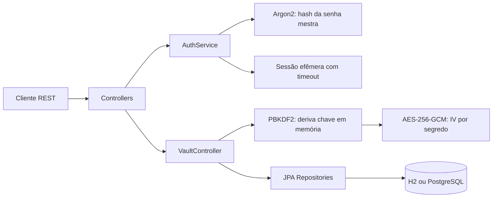

# Vaultify

API REST de cofre de senhas em Java 21 + Spring Boot. O protótipo roda com H2 em memória e pode trocar o banco por PostgreSQL via configuração Spring.

## Executar

```bash
mvn spring-boot:run
```

Para executar com PostgreSQL:

```bash
docker compose up -d postgres
mvn spring-boot:run -Dspring-boot.run.profiles=postgres
```

Documentação interativa: `http://localhost:8080/swagger-ui.html`  
Health check: `http://localhost:8080/actuator/health`

Principais endpoints:

- `POST /api/auth/register` e `POST /api/auth/login`
- `POST /api/auth/totp/setup` para ativar TOTP e obter a URI `otpauth://`
- `POST /api/auth/refresh` para renovar o access token
- `POST /api/auth/logout` (Bearer token)
- `GET|POST /api/vault`, `PUT|DELETE /api/vault/{id}` (Bearer token)
- `GET /api/passwords/generate?length=24`

Respostas de erro seguem o formato `{ timestamp, status, message, details }`, facilitando integração com clientes e observabilidade.

## Modelo de segurança

- A senha mestra nunca é salva. O cadastro armazena somente seu hash com Argon2id.
- O salt exclusivo do usuário permite derivar a chave AES-256 com PBKDF2-HMAC-SHA256, usando 600.000 iterações.
- Cada segredo é cifrado com AES-256-GCM e um IV aleatório de 96 bits. O GCM autentica o conteúdo, evitando a fragilidade de AES-CBC sem MAC.
- A chave derivada existe apenas na sessão em memória. O banco guarda salt, IV e ciphertext, nunca a chave em texto puro.
- Sessões expiram após 15 minutos sem atividade. Em produção, o armazenamento de sessão deve ser compartilhado e protegido, ou substituído por tokens JWT com uma estratégia explícita para a chave de descriptografia.

## Arquitetura

`controller` expõe a API; `service` controla autenticação, sessões e regras; `repository` persiste entidades JPA; `util` concentra PBKDF2, AES-GCM e geração criptograficamente segura; `model` contém `User` e `VaultEntry`.



O token atual é opaco e aleatório, associado a uma sessão em memória. Isso evita colocar a chave de descriptografia em um JWT; em uma implantação distribuída, a sessão deve migrar para um armazenamento compartilhado protegido.

O projeto é um protótipo educacional: antes de expor a internet, adicione TLS obrigatório, rate limiting, rotação/re-encriptação de chaves, gestão de segredos e 2FA TOTP.

## Qualidade e entrega

O workflow em `.github/workflows/build.yml` executa `mvn verify` em todo push e pull request. O perfil PostgreSQL usa Flyway para versionar o schema; o perfil padrão usa H2 para desenvolvimento rápido.

Para validar localmente a entrega:

```bash
mvn verify
```

O smoke test de runtime cobre health check, cadastro, login, refresh token e geração de senha. O fluxo protegido também foi validado com TOTP, criação, consulta, atualização, exclusão e logout do cofre.